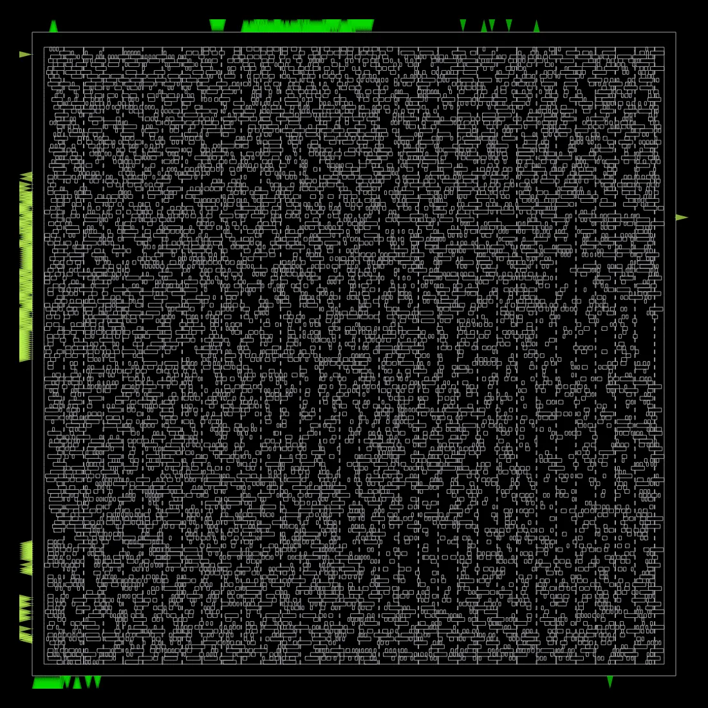
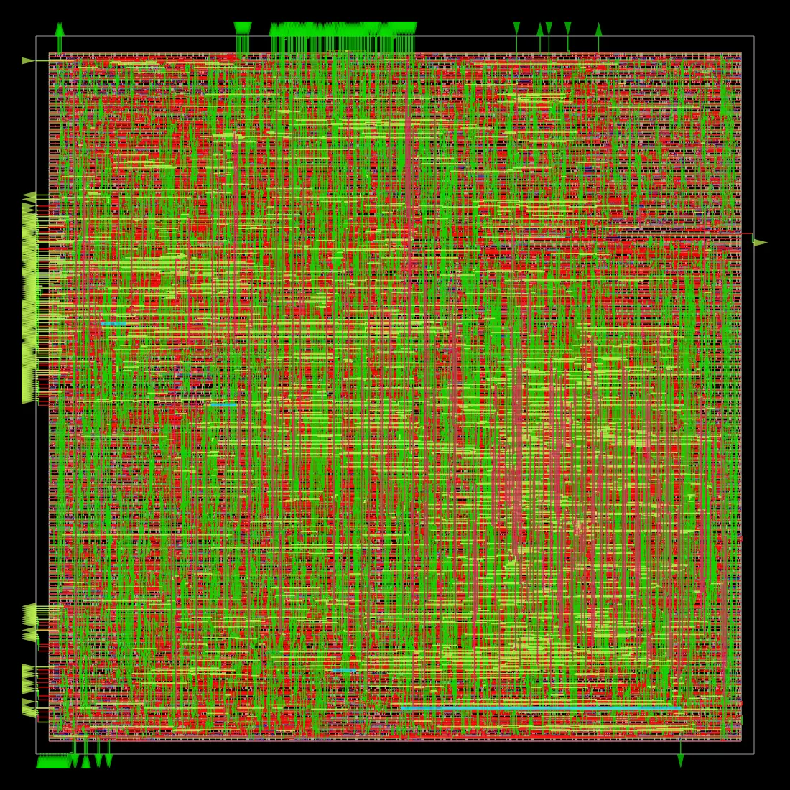

# OpenROAD Physical Design Results

Run date: 2026-07-02  
Design: `openMSP430`  
Platform: `sky130hd`  
Flow: OpenROAD-flow-scripts Docker image `openroad/orfs:latest`

## Closed Baseline Variant

The clean baseline physical-design run is `util30_ar10_pd040_pad1`, using:

- `CORE_UTILIZATION=30`
- `CORE_ASPECT_RATIO=1.0`
- `CORE_MARGIN=8`
- `PLACE_DENSITY=0.40`
- `CELL_PAD_IN_SITES_GLOBAL_PLACEMENT=1`
- `CELL_PAD_IN_SITES_DETAIL_PLACEMENT=1`

This run completed synthesis, floorplan, placement, CTS, global route, detailed
route, filler insertion, final report generation, and DEF-to-GDS merge.

| Metric | Value |
| --- | ---: |
| Final setup WNS at 50 ns | 35.555 ns |
| Final hold WNS | 0.231 ns |
| Final TNS | 0.000 ns |
| Estimated Fmax | 69.226 MHz |
| Die area | 203,527 um2 |
| Core area | 187,999 um2 |
| Placed standard-cell area | 66,966.7 um2 |
| Final utilization | 35.621% |
| Global-route wirelength | 496,869 um |
| Detailed-route wirelength | 362,584 um |
| Detailed-route DRC | 0 |
| Antenna violations | 0 net / 0 pin |
| Final total power | 0.004505 W |
| Worst VDD IR drop | 0.00008075 V |

Generated final artifacts are checked in under:

- `physical-design/results/final/util30_ar10_pd040_pad1/6_final.gds`
- `physical-design/results/final/util30_ar10_pd040_pad1/6_final.def.gz`
- `physical-design/results/final/util30_ar10_pd040_pad1/6_final.v.gz`
- `physical-design/results/final/util30_ar10_pd040_pad1/6_final.spef.gz`
- `physical-design/results/final/util30_ar10_pd040_pad1/6_final.sdc`

## Routability Exploration

The initial baseline and intermediate floorplans met timing and global-route
congestion targets, but detailed routing exposed met1/met2 pin-access and short
violations. Lowering utilization alone improved the DRC count but did not fully
close the design. Adding one-site placement padding at 30% target utilization
gave the router enough local whitespace to converge.

| Variant | Outcome |
| --- | --- |
| `base` | Global route completed with 0 global-route violations; detailed route was congested at the default 65% target utilization. |
| `util45_ar10_pd050` | Global route completed; detailed route still produced thousands of DRC violations. |
| `util35_ar10_pd045` | Improved detailed-route DRC compared with 45%, but did not close cleanly. |
| `util35_ar10_pd045_m2` | Raising the minimum routing layer to met2 worsened placement/routability pressure, so it was dropped. |
| `util30_ar10_pd040_pad1` | Completed final GDS with 0 DRC and 0 antenna violations. |

OpenROAD screenshots for the clean final run are in
`physical-design/results/images/util30_ar10_pd040_pad1/`.

Blank cells in `results.csv` mean the flow did not reach the stage that emits
that metric for the variant (e.g. no `drc_count` for runs whose detailed route
was aborted); values are never guessed.

## Implementation Notes

- The SDC uses `dco_clk`, the real top-level clock input, rather than generated
  downstream clock outputs.
- ORFS Kepler LEC is disabled in this repo config because the current Docker
  image can auto-enable it when the binary is present; under the local amd64
  Docker emulation setup it crashed before CTS. The physical-design PPA and
  routing closure flow is otherwise complete.
- Raw ORFS work directories are kept under `physical-design/orfs-work/` and are
  gitignored. The repository tracks the design config, run scripts, summary CSV,
  selected reports/images, and compact final artifacts.
